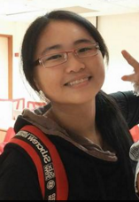
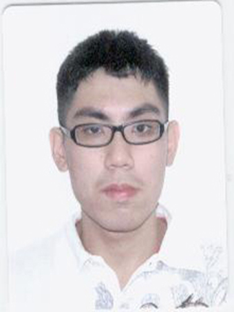
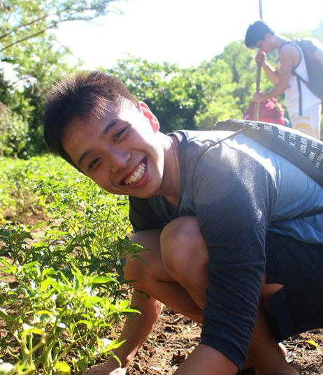
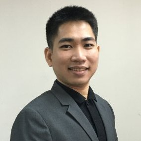

# About Us

We are a team of students at National University of Singapore, building a task management app for the module CS2103 - Software Engineering.

## Project Team

# Roles and Responsibilities
#### [Bay Chuan Wei Candiie](https://github.com/Candiie)  
 
**Role**: Project Advisor

#### [Tan Boon Joon](http://github.com/lejolly)
 
Role: Developer    
Responsibilities: Team Lead, Integration

#### [Goh Yi Da Jeremy](https://github.com/MightyCupcakes)
 
Role: Developer    
Responsibilities: Testing

#### [Ning Yu](https://github.com/ningyuuu)
 
Role: Developer    
Responsibilities: Documentation, UI 

#### [San Sok San](https://github.com/ericsssan)
 
Role: Developer    
Responsibilities: Quality Control

## Tool Specialists
* **Travis, Gradle**: Jeremy
* **Java 8**: Eric
* **JavaFX**: Ning Yu
