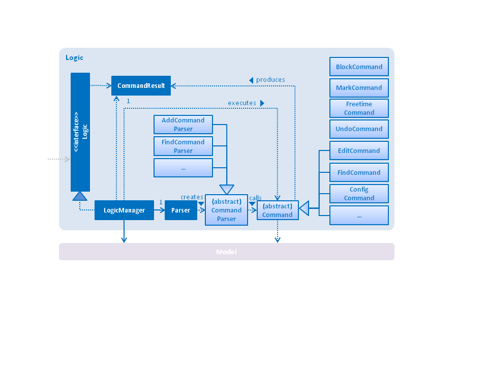
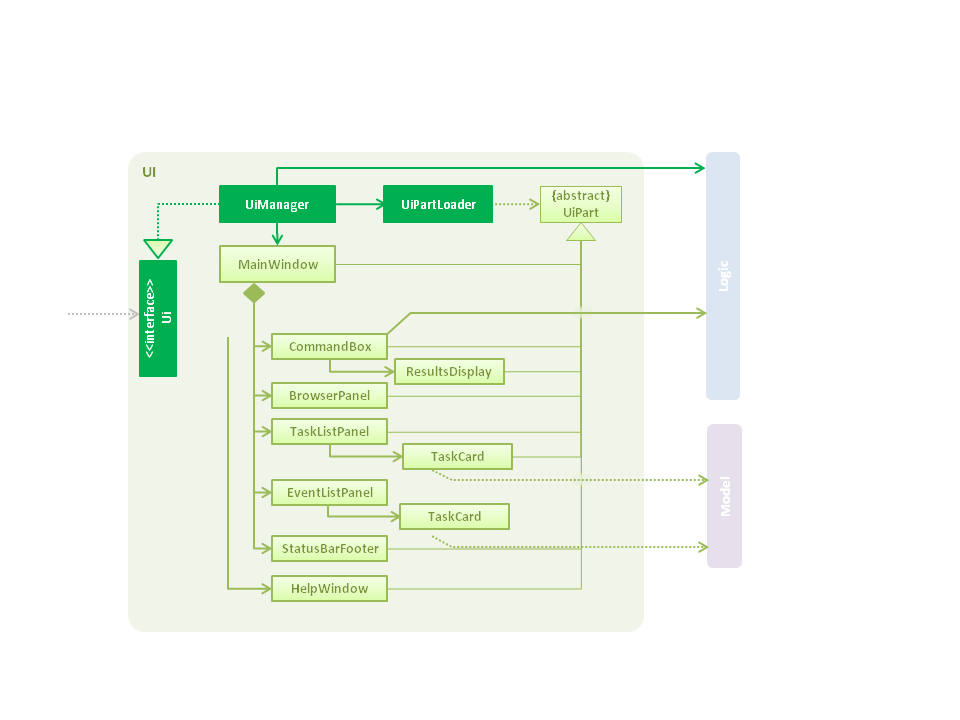
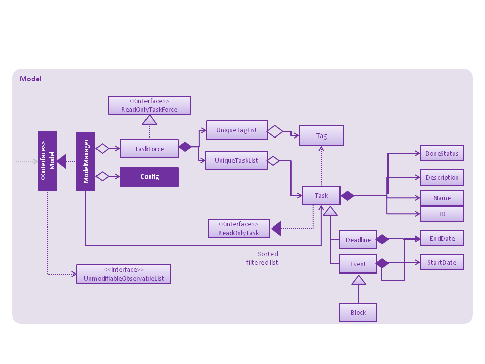

# Developer Guide

* [Setting Up](#setting-up)
* [Design](#design)
* [Implementation](#implementation)
* [Testing](#testing)
* [Dev Ops](#dev-ops)
* [Appendix A: User Stories](#appendix-a--user-stories)
* [Appendix B: Use Cases](#appendix-b--use-cases)
* [Appendix C: Non Functional Requirements](#appendix-c--non-functional-requirements)
* [Appendix D: Glossary](#appendix-d--glossary)
* [Appendix E : Product Survey](#appendix-e-product-survey)

## Setting up

#### Prerequisites

1. **JDK `1.8.0_60`**  or later 

    > Having any Java 8 version is not enough.  
    This app will not work with earlier versions of Java 8.

2. **Eclipse** IDE
3. **e(fx)clipse** plugin for Eclipse (Do the steps 2 onwards given in
   [this page](http://www.eclipse.org/efxclipse/install.html#for-the-ambitious))
4. **Buildship Gradle Integration** plugin from the Eclipse Marketplace

#### Importing the project into Eclipse

0. Fork this repo, and clone the fork to your computer
1. Open Eclipse (Note: Ensure you have installed the **e(fx)clipse** and **buildship** plugins as given
   in the prerequisites above)
2. Click `File` > `Import`
3. Click `Gradle` > `Gradle Project` > `Next` > `Next`
4. Click `Browse`, then locate the project's directory
5. Click `Finish`

  > * If you are asked whether to 'keep' or 'overwrite' config files, choose to 'keep'.
  > * Depending on your connection speed and server load, it can even take up to 30 minutes for the set up to finish
      (This is because Gradle downloads library files from servers during the project set up process)
  > * If Eclipse auto-changed any settings files during the import process, you can discard those changes.

## Design

### Architecture

 
The **_Architecture Diagram_** given above explains the high-level design of the App.
Given below is a quick overview of each component.

`Main` has only one class called [`MainApp`](../src/main/java/seedu/address/MainApp.java). It is responsible for,
* At app launch: Initializes the components in the correct sequence, and connect them up with each other.
* At shut down: Shuts down the components and invoke cleanup method where necessary.

[**`Commons`**](#common-classes) represents a collection of classes used by multiple other components.
Two of those classes play important roles at the architecture level.
* `EventsCentre` : This class (written using [Google's Event Bus library](https://github.com/google/guava/wiki/EventBusExplained))
  is used by components to communicate with other components using events (i.e. a form of _Event Driven_ design)
* `LogsCenter` : Used by many classes to write log messages to the App's log file.

The rest of the App consists four components.
* [**`UI`**](#ui-component) : The UI of tha App.
* [**`Logic`**](#logic-component) : The command executor.
* [**`Model`**](#model-component) : Holds the data of the App in-memory.
* [**`Storage`**](#storage-component) : Reads data from, and writes data to, the hard disk.

Each of the four components
* Defines its _API_ in an `interface` with the same name as the Component.
* Exposes its functionality using a `{Component Name}Manager` class.

For example, the `Logic` component (see the class diagram given below) defines it's API in the `Logic.java`
interface and exposes its functionality using the `LogicManager.java` class. 
 

The _Sequence Diagram_ below shows how the components interact for the scenario where the user issues the
command `delete 1`.

>Note how the `Model` simply raises a `TaskForceChangedEvent` when the TaskForce app data are changed,
 instead of asking the `Storage` to save the updates to the hard disk.

The diagram below shows how the `EventsCenter` reacts to that event, which eventually results in the updates
being saved to the hard disk and the status bar of the UI being updated to reflect the 'Last Updated' time.  

> Note how the event is propagated through the `EventsCenter` to the `Storage` and `UI` without `Model` having
  to be coupled to either of them. This is an example of how this Event Driven approach helps us reduce direct
  coupling between components.

The sections below give more details of each component.

### UI component

 

**API** : [`Ui.java`](../src/main/java/seedu/address/ui/Ui.java)

The UI consists of a `MainWindow` that is made up of parts e.g.`CommandBox`, `ResultDisplay`, `TaskListPanel`,
`StatusBarFooter` etc. All these, including the `MainWindow`, inherit from the abstract `UiPart` class
and they can be loaded using the `UiPartLoader`.

The `UI` component uses JavaFx UI framework. The layout of these UI parts are defined in matching `.fxml` files
 that are in the `src/main/resources/view` folder. 
 For example, the layout of the [`MainWindow`](../src/main/java/seedu/address/ui/MainWindow.java) is specified in
 [`MainWindow.fxml`](../src/main/resources/view/MainWindow.fxml)

The `UI` component,
* Executes user commands using the `Logic` component.
* Binds itself to some data in the `Model` so that the UI can auto-update when data in the `Model` change.
* Responds to events raised from various parts of the App and updates the UI accordingly.

### Logic component

 

**API** : [`Logic.java`](../src/main/java/seedu/address/logic/Logic.java)

1. `Logic` invokes the `Parser` class to parse the user command.
2. Upon recognizing the command, it sends the arguments to the `CommandParser` class, which recognizes the remaining arguments.
3. This information is then captured in a `Command` object which is executed by the `LogicManager`.
4. The command execution can affect the `Model` (e.g. adding a person) and/or raise events.
5. The result of the command execution is encapsulated as a `CommandResult` object which is passed back to the `Ui`.

Given below is the Sequence Diagram for interactions within the `Logic` component for the `execute("delete 1")`
 API call.  
 

### Model component

 

**API** : [`Model.java`](../src/main/java/seedu/address/model/Model.java)

The `Model`,
* stores a `UserPref` object that represents the user's preferences.
* stores the TaskForce app data.
* exposes a `UnmodifiableObservableList<ReadOnlyTask>` that can be 'observed' e.g. the UI can be bound to this list
  so that the UI automatically updates when the data in the list change.
* does not depend on any of the other three components.
* 3 different classes of tasks implement the `ReadonyTask` interface: `Task`, the most basic form (with only ID, Name and Description), as well as `Deadline` and `Event`, which extends it.
  * Deadlines contain an endDate, Events contain a StartDate and EndDate.
* The model also holds a list of `Tags` through a `UniqueTagList`.

### Storage component

  

**API** : [`Storage.java`](../src/main/java/seedu/address/storage/Storage.java)

The `Storage` component,
* can save `UserPref` objects in json format and read it back.
* can save the TaskForce app data in xml format and read it back.

### Common classes

Classes used by multiple components are in the `seedu.addressbook.commons` package.

## Implementation

### Logging

We are using `java.util.logging` package for logging. The `LogsCenter` class is used to manage the logging levels
and logging destinations.

* The logging level can be controlled using the `logLevel` setting in the configuration file
  (See [Configuration](#configuration))
* The `Logger` for a class can be obtained using `LogsCenter.getLogger(Class)` which will log messages according to
  the specified logging level
* Currently log messages are output through: `Console` and to a `.log` file.

**Logging Levels**

* `SEVERE` : Critical problem detected which may possibly cause the termination of the application
* `WARNING` : Can continue, but with caution
* `INFO` : Information showing the noteworthy actions by the App
* `FINE` : Details that is not usually noteworthy but may be useful in debugging
  e.g. print the actual list instead of just its size
  
### Tasks
All tasks created in TaskForce are immutable. The whole program revolve around Adding and Deleting Tasks. Commands Such as EditCommand
MarkCommands are extension of Addding and Deleting Tasks.

* Adding and Deleting Tasks will trigger an event to inform and update the Model side that the list is updated.
* Having commands revolve around Adding and Deleting simplify our implementation as the Model only have to listen to when Tasks are
added or deleted.

### FindCommand
Our FindCommand is implemented to replace the old ListCommand found in TaskForce. ListCommand simply list out all the tasks found in 
TaskForce and this may become a problem when the list get too big. User have to scroll up and down to locate the specified tasks that they are interested. As such our FindCommand are implemented to allow users to filter out tasks in a few ways.

* Keywords Searched are filtered by TagName, Description and TaskName
* Tasks can be filtered by Event that start/end or are ongoing on a particular day. This include Deadline and Reminders.
* Tasks can also be filtered by Week, showing all the task that is due/ongoing on a particular Week defined as Monday to Friday.

As such our Findcommand covered everything a ListCommand. The key difference is that instead of listing everything on TaskForce,
It allow Users to filter out their list by FindType.

### UndoCommand
We have set a limit for UndoCommand to 10. Users can only undo up to 10 previous command that they have inputted while the program is 
active. Having a ceiling for UndoCommand prevent any form of huge resource hog by TaskForce and this allow Users to multitasks many 
programs with TaskForce opened at the same time.

### SortedList
TaskForce wrap around the ObservableList with a FilteredList, this allow Users to filter out keyword using TaskForce's FindCommand.
The FilteredList is furthur wrapped with a SortedList to ensure the list shown to Users are constantly sorted at all time.
The nature of the ObservableList allow the list shown to be constantly updated whenever a new changes occured such as Addition/Deletion of a new Tasks

### CdCommand
The CdCommand recreate the config.json file using default Config Class as a base. The only difference is that the config.json file will contained the new savepath indicated by users. Any modification made directly to the config.json file will be overwritten when
CdCommand is used. This command is for new users who are not comfortable with editing the config.json file. 
Advanced Users are adviced to change the config.json directly to meet their needs.

### Configuration

Certain properties of the application can be controlled (e.g App name, logging level) through the configuration file
(default: `config.json`):

## Testing

Tests can be found in the `./src/test/java` folder.

**In Eclipse**:
> If you are not using a recent Eclipse version (i.e. _Neon_ or later), enable assertions in JUnit tests
  as described [here](http://stackoverflow.com/questions/2522897/eclipse-junit-ea-vm-option).

* To run all tests, right-click on the `src/test/java` folder and choose
  `Run as` > `JUnit Test`
* To run a subset of tests, you can right-click on a test package, test class, or a test and choose
  to run as a JUnit test.

**Using Gradle**:
* See [UsingGradle.md](UsingGradle.md) for how to run tests using Gradle.

We have two types of tests:

1. **GUI Tests** - These are _System Tests_ that test the entire App by simulating user actions on the GUI.
   These are in the `guitests` package.

2. **Non-GUI Tests** - These are tests not involving the GUI. They include,
   1. _Unit tests_ targeting the lowest level methods/classes.  
      e.g. `seedu.address.commons.UrlUtilTest`
   2. _Integration tests_ that are checking the integration of multiple code units
     (those code units are assumed to be working). 
      e.g. `seedu.address.storage.StorageManagerTest`
   3. Hybrids of unit and integration tests. These test are checking multiple code units as well as
      how the are connected together. 
      e.g. `seedu.address.logic.LogicManagerTest`

**Headless GUI Testing** :
Thanks to the [TestFX](https://github.com/TestFX/TestFX) library we use,
 our GUI tests can be run in the _headless_ mode.
 In the headless mode, GUI tests do not show up on the screen.
 That means the developer can do other things on the Computer while the tests are running. 
 See [UsingGradle.md](UsingGradle.md#running-tests) to learn how to run tests in headless mode.

## Dev Ops

### Build Automation

See [UsingGradle.md](UsingGradle.md) to learn how to use Gradle for build automation.

### Continuous Integration

We use [Travis CI](https://travis-ci.org/) to perform _Continuous Integration_ on our projects.
See [UsingTravis.md](UsingTravis.md) for more details.

### Making a Release

Here are the steps to create a new release.

 1. Generate a JAR file [using Gradle](UsingGradle.md#creating-the-jar-file).
 2. Tag the repo with the version number. e.g. `v0.1`
 2. [Crete a new release using GitHub](https://help.github.com/articles/creating-releases/)
    and upload the JAR file your created.

### Managing Dependencies

A project often depends on third-party libraries. For example, Address Book depends on the
[Jackson library](http://wiki.fasterxml.com/JacksonHome) for XML parsing. Managing these _dependencies_
can be automated using Gradle. For example, Gradle can download the dependencies automatically, which
is better than these alternatives. 
a. Include those libraries in the repo (this bloats the repo size) 
b. Require developers to download those libraries manually (this creates extra work for developers) 

## Appendix A : User Stories

Priorities: High (must have) - `* * *`, Medium (nice to have)  - `* *`,  Low (unlikely to have) - `*`

Priority | As a ... | I want to ... | So that I can...
-------- | :-------- | :--------- | :-----------
`* * *` | new user | see usage instructions | refer to instructions when I forget how to use the App
`* * *` | user | search tasks by day | see what is due or my available on a specific day
`* * *` | user | search tasks by week | see what is due or my available on a specific week
`* * *` | user | add a new task | add items to my calendar or task list
`* * *` | user | mark a task | mark task as done after I have completed it
`* * *` | user | delete a task | remove tasks that I have completed or give up
`* * *` | user | find a task by keyword | find all the tasks that contain that keyword
`* * *` | user | edit a task's information | update/change the detail of a task
`* * *` | user | specify database location | save the data in my preferred location
`* * *` | user | to block timeslots | so that i can reserve time for tasks that are not confirmed
`* * *` | user | to confirm one of the blocked timeslots | so that i can confirm which blocked timeslot I want and release the rest
`* * *` | user | tag a task | so that I can search by classification or group
`* *` | user   | find tasks that are overdue | so i can do them as soon as possible
`* *` | user   | be informed of conflicts | so that I can refrain from assigning 2 things to the same task
`* *` | user | see free time | be informed of my available time slots
`* *` | advanced user | set working hours | non-working hours will be automatically blocked out
`*` | advanced user | set recurring task | so the task can repeat itself without me entering it constantly
`*` | user | sync to google calendar | know what is going on in all my digital platforms
`*` | advanced user | use natural language | make planning tasks more natural and intuitive

{More to be added}

## Appendix B : Use Cases

(For all use cases below, the **System** is the `TaskForce` app and the **Actor** is the `user/Jim`, unless specified otherwise)

### Use case : Adding a new task

**MSS:**

1. User enters the add command in the CLI along with the details for the task.

2. System will display that the task has been added to the ToDoList.

Use case ends

**Extensions:**

1a. Add command syntax entered by the user is incorrect.

>The system will display an error message along with the suggested format of the add command.

1b. User enter a endDate bigger than startDate
>The System will display "Please make sure your end date is later than start date".

Use case ends

### Use case: Find tasks - filter by keyword

**MSS:**

1. User will enter the keyword that he want to search for
2. The system will display a list of tasks that contain the keyword.

Use case ends

**Extension:**

1a. User enters no keyword.
> The system will display "Invalid command format" along with the format of findCommand.

Use case ends

### Use case: Find tasks - filter by day/week

**MSS:**

1. User will enter the day/week he want to look at using CLI.
2. The System will display a list of tasks that are related(start/due on) to the day/week.

Use case ends

**Extension:**

1a. User enter a input that is not a number
> The System will display "please enter a valid number when search by day/week".
1b. User will enter the wrong syntax for find command
> The system will display "Invalid command format" along with the format of findCommand.

Use case ends

### Use case : Delete a task (one entry)

**MSS:**

1. User will enter the index of the task to be deleted using CLI.
2. System will display "Deleted Task(s) : TASKNAME".

Use case ends

**Extensions:**

1a. User enter a non-integer value or invalid number.
> The System will display "Invalid command format!" along with the format of the delete command

1b. User enter an invalid index.
> System will display 'the following indexes are invalid and ignore: INDEXES' and proceed to delete the valid index found.

Use case ends

### Use case : Delete tasks (multiple entries)

**MSS:**

1. User will enter mutiple indexs of tasks to be deleted using CLI
2. System will display "Deleted Task(s): INDEXES"

Use case ends

**Extensions:**

1a. User enter a non-integer value.
> The System will display "Invalid command format!" along with the format of the delete command.

1b. User enter an invalid index.
> System will display 'the following indexes are invalid and ignore: INDEXES' and proceed to delete the valid index found.

Use case ends

### Use case : Editing a task (edit)

**MSS:**

1. User will enter the index of the tasks to be edited along with new data.
2. System will display "Edit saved!".

Use case ends

**Extensions:**

1a. Index provided by user is not valid
>The system will display an error message along with the suggested format for the edit command

Use case ends.

1b. Not all details are provided by the user.
>The system will only edit the details of the task the user provides and leave the rest unmodified.

Use case ends.

1c. The user did not enter any new details
>The system will leave the task unmodified

Use case ends.

### Use case : Clear task list (clear)

**MSS:**

1. User will enter clear to clear the save data.
2. The system will display 'TaskForce has been cleared'.

Use case ends

### Use case : Changing saving data location (cd)

**MSS:**

1. User will enter a new path to store and save the saveData.
2. The system will display 'file has been saved to location successfully in PATH'.

Use case ends

**Extension:**

1a. User enter the wrong format of savedata
> The System will display "please end filename with .xml" along with the format of cd command
1b. User enter an invalid path
> The System will display "please enter valid file path" along with the format of cd command

Use case ends

### Use case: Exit app

**MSS:**

1. User will enter the exit command using CLI.
2. The System window will close down automatically.

Use case ends

### use case: Help command

**MSS:**

1. User will enter help command using CLI.
2. The system will pop up a new window that display the list of commandFormat.

Use case ends

### Use case : select command - select a task

**MSS:**

1. User will enter the index of the task he want to select.
2. System will highlight the task that is selected.

Use case ends

**Extension:**

1a. User enter an invalid index
> The System will display "The task index provided is invalid".

### Use case : Mark command - marking/unmarking a task

1. User will enter the index of the task he want to mark/unmark.
2. The system will display a marked icon(mark) OR remove the marked icon(unmark) on the task card.

Use case ends

**Extension:**

1a. User enter an invalid index
> The System will display "The task index provided is invalid".
1b User will enter a input that is not a number
> The System will display "Invalid command format!" along with the format of markCommand.

Use case ends

### Use case : Undoing previous action

1. User will enter undo using CLI
2. The system will display "Undid the most recent command" along with the updated list for display.

Use case ends

** Extension:**

1a. There is no previous action
> System will prompt user that there is no previous action to be undone.

### Use case: Redoing previously undone action

1. User will enter redo using CLI
2. The system will display "Redid the most recent undone command" along with the updated list for display.

Use case ends

** Extension: **

1a. There is no previous undone action
> System will prompt user that there is no previous undone action to be redone.

## Appendix C : Non Functional Requirements

1. Should work on any [mainstream OS](#mainstream-os) as long as it has Java `1.8.0_60` or higher installed.
2. Should be able to hold up to 1000 tasks.
3. Should come with automated unit tests and open source code.
4. Should favor DOS style commands over Unix-style commands.
5. Should not take more than 5 seconds when executing find command
6. Should not use too much memory (less than 250 MB)
7. Should be able to recreate a new save data in a event of corruption/missing file
8. Should be open source and allow developer to contribute to the project anytime
9. Should always maintain an updated version of both UserGuide and DeveloperGuide 
10. Should come free without having Users pay money to use the software.

### Project Constraints NFR
11. Final product should be a result of morphing using level4 code
12. Software must work on desktop without internet connection
13. Software must be stand-alone with optional extensions
14. CommandLine must be the primary mode of input
15. Software must not use any form of relational database
16. Data must be stored locally and human editable
17. All data must be stored locally and be in human editable text file
18. Project should followed Object-oriented-paradigm
19. Software must work without any form of installer
20. Third-party library/framwork are only allowed if they are free and require no form of installation

{More to be added}

## Appendix D : Glossary

##### Mainstream OS

> Windows, Linux, Unix, OS-X

## Appendix E : Product Survey

Product Name | Strengths | Weakness
----------- | :---------------- | :----------------
Todoist | Easily classified todo categories, collaboration, notifications | Labels & reminders are premium. Quest points gamification
OmniFocus | Allows a large amount of information to be organized | Way too complex for the average, simple user
Google Keep | Simple to use, lightweigh | Text based with no advanced functionality. No events
Todo.txt | <ul><li> Can assign priority to task</li> <li>can associate many small task to a bigger task/project</li> <li> can search by keyword or by association to a projectName</li> <li>visual representation depending on priority of task </li> </ul> | <ul> <li>Require Addon to support task with due dates</li> <li> Require user to follow a strict input format</li> <li> does not tell you what time you are free</li> <li>Does not tell you if your task are overdue</li></ul> 
Remember the Milk |  <ul> <li>Allows the management of large number of tasks</li> <li> Clean GUI </li> <li> Predefined search terms allows for easy access to tasks that are due in the near future <li> Allows for multiple lists which allows for seperation of tasks according to users perference (such as work-related tasks and personal tasks not in the same list)</li><li>Allows for tranferring of tasks to others using the app which can be used as a collaboration tool in an organisation</li><li>Has a mobile app which allows for usage in multiple devices in different occasions</li> </ul> | <ul> <li>Requires many clicks to add simple deadline that is due on some day not in the near future because of the calendar GUI</li><li>Very confusing for a new user due to functions hidden behind small buttons with icons that are not very intuitive.</li><li>Lots of information is hidden in the UI which requires the user to click on each task individually in order to view them</li><li>Offline mode is only avaliable to paying users</li></ul>
Any.do | <ul>  <li>Any.do Moment show tasks due TODAY </li> <li>Any.do Moment allows rescheduling, marking as done or delete </li>  <li> Allow users to set reminders </li> <li>Allow users to add sub-tasks to break a bigger task down </li> <li>User can see what due today/tomorrow or upcoming </li></ul>  | <ul> <li>Cannot block timeslots to reserve them </li>  <li>Requires internet connection for syncing of data </li>  <li> Frees user cannot customise recurring tasks</li>  <li> Free user cannot access Any.do Moment</li>  <li>Require monthly/yearly subscription for premium services  </li><li>Requires a lot of clicking</li> </ul> 

In general, most products lack a command line interface, or the customization that Jim needs - the ability to block, the ability to set time properly, etc.
