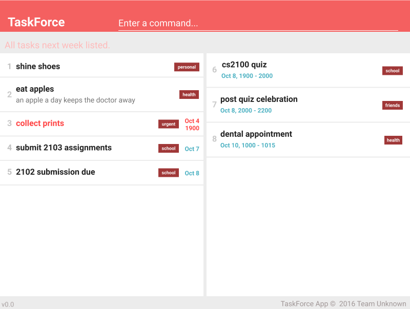

# User Guide

* [Overview](#overview)
* [Quick Start](#quick-start)
* [Features](#features)
* [FAQ](#faq)
* [Command Summary](#command-summary)

## Overview

1. TaskForce allows you to manage his tasks through a simple
command-line interface (CLI)-based application.
2. It allows for 3 main kinds of tasks:  
   * Reminders - a task with no start nor end date  
   * Deadline - a task that ends at a specific time  
   * Event - an event has both a start and end time
3. You can also block out time from your calendar through this app, through the
implementation of blocks - events with no name (placeholders).
4. This app is built on Java, and runs on any Desktop.

## Quick Start

0. Ensure you have Java version `1.8.0_60` or later installed in your Computer. 
   > Having any Java 8 version is not enough.  
   This app will not work with earlier versions of Java 8.

1. Download the latest `taskforce.jar` from the [releases](../../../releases) tab.
2. Copy the file to the folder you want to use as the home folder for your TaskForce app.
3. Double-click the file to start the app. The GUI should appear in a few seconds.
   > 

4. Type the command in the command box and press <kbd>Enter</kbd> to execute it.  
   e.g. typing **`help`** and pressing <kbd>Enter</kbd> will open the help window.
5. Some example commands you can try:
   * **`add`**` wash the toilet ` adds a reminder to wash the toilet to the task list.
   * **`search`**` d\0` searches the task list for all tasks happening today.
   * **`exit`** : exits the app
6. Refer to the [Features](#features) section below for details of each command. 

## Features

> **Command Format**
> * Words in `UPPER_CASE` are the parameters.
> * Items in `SQUARE_BRACKETS` are optional.
> * Items with `...` after them can have multiple instances.
> * The order of parameters is fixed.

#### Viewing help : `help`
Displays information on how to use commands.  
Format: `help [COMMAND]`

> If a `COMMAND` is given, help is displayed for that command only.  
> If no `COMMAND` is given, help is displayed for all commands available.   
> Help is not shown if you enter an incorrect command e.g. `abcd`

#### Adding a task: `add`
Adds a task to the task list.  
Format:  
Reminder: `add TASKNAME  [d/DESCRIPTION] [t/TAG]...`  
Deadline: `add TASKNAME  [d/DESCRIPTION] [et/END_DATE] [t/TAG]...`  
Event: `add TASKNAME  [d/DESCRIPTION]  [st/START_DATE] [et/END_DATE] [t/TAG]...`  

> Tasks can have any number of tags (including 0)  
> Date format is [DDMMYY][HHMM] - 24 Hour format
> If no date is specified, it is taken as today/tomorrow by default (depending on whether
the time has passed at present today)  
> If no time is specified, it is taken as whole day (start 0000, end 2359) by default

Examples:
* `add housework d/to get pocket money t/important` 
* `report d/school report et/130116 2200 t/important` 
  Add the task into the ToDoList using `add` command.

#### Blocking out time: `block`  
Blocks out time for a potential event, or to indicate unavailability to others
Format: `block s/START_DATE e/END_DATE`

> Blocked out time is only blocked, cannot be tagged, cannot be named
> Date format is [DDMMYY] [HHMM] (24 Hour format)  
> If no date is specified, it is taken as today/tomorrow by default (depending on whether
the time has passed at present today)  
> If no time is specified, it is taken as whole day (start 0000, end 2359) by default

Examples:
* `block meeting with boss s/1400 e/1600`
* `block potential compliance audits s/1300 e/1800`

#### Searching for (a) specific task(s): `find`
Finds tasks of a specific time, or whose names contain any of the given keywords.  
Format: `find METHOD DETAILS `

Method | Explanation | Example
-------- | :-------- | :---------
`d/` | List all events a number of days after today | `find d/ -1` (yesterday)
`w/` | List all events in a week, after current week | `find w/ 0` (current week)
`e/` | List all events with word appearing in name | `find e/ ceremony`
`dl/` | List all deadlines with word appearing in name | `find dl/ homework`
`r/` | List all reminders with word appearing in name | `find r/ shine`
`a/` | List all events with word appearing in name | `find a/ shoes`

> * The search is not case sensitive. e.g `hans` will match `Hans`
> * The order of the keywords does not matter. e.g. `Hans Bo` will match `Bo Hans`
> * Only the name is searched.
> * Only full words will be matched e.g. `Han` will not match `Hans`
> * Persons matching at least one keyword will be returned (i.e. `OR` search).
    e.g. `Hans` will match `Hans Bo`

#### Deleting a task : `delete`
Deletes the specified task from the task list. Irreversible.  
Format: `delete INDEX`

> Delete the task at the specified `INDEX`.
  The index refers to the index number shown in the most recent listing. 
  The index **must be a positive integer** 1, 2, 3, ...

Examples:
* `find a/Meeting` 
  `delete 1` 
  Deletes the 1st task in the results of the `find` command.

#### Editing a task: `edit`  
Edits a task in the task list.  
Format: `edit INDEX [NAME] [d/DESCRIPTION] [s/START_DATE] [e/END_DATE]`   

> Follows index format of delete - The index refers to the index number shown in the most recent listing.  
> The index **must be a positive integer** 1, 2, 3, ...  

> You can modify a reminder into a deadline/event by adding start & end dates:  
> * `edit INDEX s/1700 e/1900`    

> You can modify an event into a deadline by using `edit INDEX s/` (leaving empty)  
> You can modify an event into a block by using `edit INDEX n/`  
> Basically, it allows you to morph events as long as they satisfy the structure
Examples:
* `edit 1 schoolwork d/change deadline et/220506 2200`
* `edit 4 dinner d/change location t/important`

#### Finding free time in a specific day: `freetime`  
Gives you all the free time blocks in a specific day
Format: `freetime [d/DAYS_FROM_TODAY]`  
> By default, freetime gives you today's free time  
> You can adjust days by using the d/ option  
> For example, for yesterday's free time, `freetime d/-1`  
> DAYS_FROM_TODAY **must be an integer**

#### Undo the previous command : `undo`
Undo the last command that was successfully executed.  
Format: `undo`

#### Clearing all entries : `clear`
Clears **ALL** entries from the task list. This command **CANNOT** be undone!  
Format: `clear`  

#### Exiting the program : `exit`
Exits the program. 
Format: `exit`  

#### Saving the data
TaskForce saves data in the hard disk automatically after any command that changes the data.  
There is no need to save manually.

## FAQ

**Q**: How do I transfer my data to another Computer? 
**A**: Install the app in the other computer and overwrite the empty data file it creates with
       the file that contains the data of your previous TaskForce folder.

## Command Summary

Command | Format  
-------- | :--------
Add | `add EVENT [d/DESCRIPTION] [t/TAG] [st/START_DATE] [et/END_DATE] [t/TAG]...`
Block | `block s/START_DATE e/END_DATE`
Clear | `clear`
Delete | `delete INDEX`
Edit | `edit INDEX [NAME] [s/START_DATE] [e/END_DATE] ...`
Freetime | `freetime [d/DAYS_FROM_TODAY]`
Find | `find KEYWORD [MORE_KEYWORDS]`
Undo | `undo`
Help | `help`
Exit | `exit`
