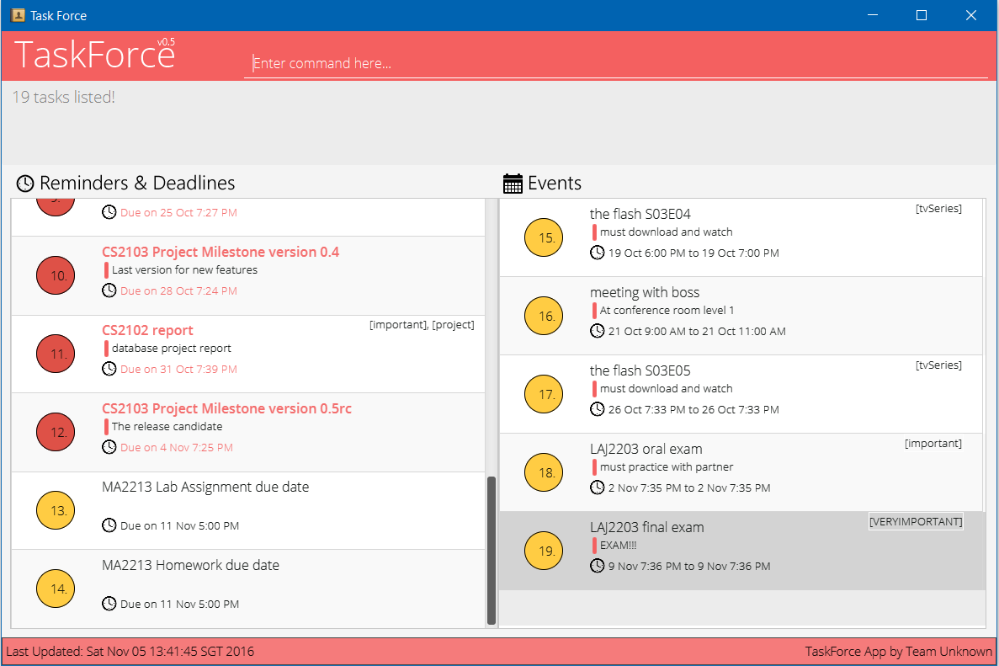

<!-- @@author A0111277M-->

# User Guide

* [Overview](#overview)
* [Quick Start](#quick-start)
* [Features](#features)
* [FAQ](#faq)
* [Command Summary](#command-summary)
* [Command Examples](#command-examples)
## Overview

1. TaskForce allows you to manage your tasks through a simple
command-line interface (CLI)-based application.
2. It allows for 3 main kinds of tasks:  
   * Reminders - a task with no start nor end date  
   * Deadline - a task that ends at a specific time  
      >  A OVERDUE TASK is a Deadline that is past today date and not marked done. 
   * Event - an event has both a start and end time  
      >  A BLOCK is an uncomfirmed event that require you to confirm it later on.
4. This app is built on Java, and runs on any Desktop.

### Advanced User
#### [Config command](#command-examples)
> 1. Once you have used the program long enough, you can use the [Config command](#command-examples) to edit the value of the config.json
> 2. You are advised not to edit the config.json file directly. If it is detected as corrupted or invalidFormat, the current config.json file will be REPLACED by a default one.
> 3. Through the config command, you can change the name of the program or set your free time .

#### Recurring functionality.
> 1. The recurring functionality in the [Add command](#command-examples) is only available to Event and Deadline
> 2. If you try to use recurring functionality on a Reminders (task with no start or end date), the system will only add it once.

## Quick Start

0. Ensure you have Java version `1.8.0_60` or later installed in your Computer. 
   > Having any Java 8 version is not enough.  
   This app will not work with earlier versions of Java 8.

1. Download the latest `taskforce.jar` from the [releases](../../../releases) tab.
2. Copy the file to the folder you want to use as the home folder for your TaskForce app.
3. Double-click the file to start the app. The GUI should appear in a few seconds.
   > 

4. Type the command in the command box and press <kbd>Enter</kbd> to execute it.  
   e.g. typing **`help`** and pressing <kbd>Enter</kbd> will open the help window.
5. Some example commands you can try:
   * **`add`**` wash the toilet ` adds a reminder to wash the toilet to the task list.
   * **`find`**` day/0` searches the task list for all tasks happening today.
   * **`exit`** : exits the app
6. Many commands requires an `INDEX` which is the number associated to the task in the current list.
       >   
       > #### The index of a task is the number beside it
        
        
7. Refer to the [Features](#features) section below for details of each command. 

## Features

> **Command Format**
> * Words in `UPPER_CASE` are the parameters.
> * Items in `[SQUARE_BRACKETS]` are optional.
> * Items with `...` after them can have multiple instances.
> * The order of parameters are not fixed.

#### Viewing help : `help`
Displays information on how to use commands.  
Format: `help`

<!-- @@author A0111277M-->

#### Adding a task: `add | schedule | remind`
Adds a task to the task list.  
Format:  
> Reminder: `add TASKNAME  [d/DESCRIPTION] [t/TAG]...`  
> Deadline: `add TASKNAME  [d/DESCRIPTION] et/END_DATE [t/TAG...] [recur/TYPE r/TIME]`  
> Event: `add TASKNAME  [d/DESCRIPTION]  st/START_DATE et/END_DATE [t/TAG...] [recur/TYPE r/TIMES]`  

> - Tasks can have any number of tags (including 0)  
> - Date format is MM-DD-YYYY HHMM (24 hour Format) e.g. `st/ 10-22-2016 1500`
> 	- The command also supports natural language keywords such as `today 6pm`
> 	- See the section [On Entering Dates](#On Entering Dates) for more details
> - If no time is specified, the time will be assumed to be the time right now.
> - If no start date is specified, it is assumed to be today.
> - If start date/time is specified but end date/time is not specified, the end date/time will be the same day on 2359.
> - FlexiCommand is available for addCommand, refer to [Command Examples](#command-examples) for examples of usage.
> - You can recur a Deadline and Event a number of times. The number of repetition must be specified using `r/POSITIVE_INTEGER` argument. 

Examples:
* `add housework d/to get pocket money t/important` 
* `add report d/school report et/130116 2200 t/important` 
  Add the task into the TaskForce using `add` command.

<!-- @@author A0135768R-->
#### Blocking out time: `block`
Blocks out time for a potential Event.  
This command can block multiple timeslots at once, all for one specific event.  
If multiple timeslots were blocked, when one timeslot is confirmed, all other timeslots are released (further explained in the [Confirm command](#command-examples))      

Format: `block NAME st/START_DATE et/END_DATE [st/START_DATE et/END_DATE]...`

> - Blocked out time is only blocked and cannot be tagged.  
> - Each `st/START_DATE` and `et/END_DATE` is a pair, and you can have unlimited pairs.
> - Date format is MM-DD-YYYY HHMM (24 hour Format) e.g. `st/ 10-22-2016 1500`
> 	- The command also supports natural language dates such as `today 6pm`
> 	- See the section [On Entering Dates](#On Entering Dates) for more details
> - If no start date is specified, it is assumed to be today on the time provided.
> - If no end date is specified, the end date will be the same day as the start date on the time provided.
> - Failing to provide any start and/or end dates will result in a invalid command.

Examples:
* `block meeting with boss st/1400 et/1600 st/tommorrow 1400 et/1600`
* `block study period st/1300 et/1800 st/tomorrow 2000 et/`

#### Confirming previously blocked time: `confirm`  
Confirms a blocked out time and converts it into an event  
Deletes all other blocked timeslots for the same event

Format: `confirm INDEX st/START_TIME et/END_TIME [d/DESCRIPTION][t/TAG...]`
> - To use this function, you must first list the desired timelot by using [find command](#command-examples).
> - Following which, you can use this command to confirm your desired slot.
> - All other times associated to the previously blocked out Event will be released, even if they are not in the current view.
> - At the same time you can also change Event name, description or add additional tags. 

Examples:
* `confirm 5 d/venue TBC st/6pm et/8pm t/important`

<!-- @@author A0139942W-->
#### Searching for (a) specific task(s): `find`
Finds tasks of a specific time, or whose names contain any of the given keywords.  
Format: `find METHOD/ KEYWORDS [mark/TRUE]`  
KEYWORDS for TYPE `name/` `desc/` `tag/` is a word that is contain/part of a task name/description/tag  
KEYWORDS for TYPE `day` and `week` is an integer number.

Method | Explanation | Example
-------- | :-------- | :---------
`day/` | List all events/deadline a number of days after today | `find day/ -1` (yesterday)
`week/` | List all events/deadline in a week, after current week | `find week/ 0` (current week)
`name/` | List all tasks with taskName containing the keywords | `find name/ shoes`
`tag/` | List all tasks with taskDescription containing the keywords | `find tag/ important`
`desc/` | List all tasks with the tags of task containing the keywords | `find desc/ red underwear`

> * The search is not case sensitive. e.g `task` will match `TaSK`
> * The order of the keywords does not matter. e.g. `is s task` will match `task is a`
> * Sub-words will be matched e.g. `sk` will match `task`
> * Tasks matching at least one keyword will be returned (i.e. `OR` search).

> * Find command filtered out marked tasks automatically, user can turn off filter by using [mark/TRUE]
to include marked task in search
* 'find name/i wan to find marked task mark/true'

#### Searching for (a) specific task(s) under certain category: 'find'
Find tasks that belong to a certain category.  
Format: `find TYPE/CATEGORY`  
`CATEGORY` is defined as `all`, `overdue`, `mark`. Any other category will be classified
as invalid command.

Method | Explanation | Example
-------- | :-------- | :---------
'type/all' | List out every task stored in the save data | 'find type/all'
'type/overdue' | List out all deadline that are overdue and not marked | 'find type/overdue'
'type/mark' | List out all tasks that are marked done | 'find type/mark'

<!-- @@author A0135768R-->
#### Deleting a task : `delete` (undoable)
Deletes the specified task from the task list. 
Format: `delete INDEX[, INDEX,...]`

> - Delete the task at the specified `INDEX`.
> - To delete more than one task, seperate the tasks indexes with commas.
> - The index refers to the index number shown in the most recent listing. 
> - The index **must be a positive integer** 1, 2, 3, ...

Examples:
* `find all/ Meeting` 
  `delete 1` 
  Deletes the *1st* task in the results of the `find` command.

<!-- @@author A0111277M-->
#### Editing a task: `edit`  
Edits a task in the task list.  
Format: `edit INDEX [NAME] [d/DESCRIPTION] [st/START_DATE] [et/END_DATE] [t/TAGS...]`   

> - Follows index format of delete - The index refers to the index number shown in the most recent listing.
> - Only enter in the details you want to edit. Details not specified in this command will not be changed.  
> - The index **must be a positive integer** 1, 2, 3, ...  
> - You can modify a reminder into a deadline/event by adding start & end dates or change a event to deadline/reminder etc:  
> 	 * `edit INDEX st/1700 et/1900`    
> - For tags, the edit command follows the following rules:
> 	- If the task does not have a tag specified in the edit command, the edit command shall add that tag to the task.
> 	- If the task does have a tag specified in the edit command, the edit command will remove that tag from the task.
> 	- If the task posesses some tags not specified in the edit command, they will be left unchanged by this command.

Examples:
* `edit 1 schoolwork d/change deadline et/220506 2200`
* `edit 4 dinner d/change location t/important`

<!-- @@author A0139942W-->
#### Finding free time in a specific day: `freetime`  
Gives you all the free time blocks in a specific day  
Format: `freetime [day/DAYS_FROM_TODAY]`   
> - By default, freetime gives you today's free time  
> - You can adjust days by using the day/ option  
> - For example, for yesterday's free time, `freetime day/-1`  
> - DAYS_FROM_TODAY **must be an integer**

<!-- @@author A0140037W-->
#### Undo the previous command : `undo`
Undo the last command that was successfully executed.  
Format: `undo`  
Keybinding: <kbd>Control-Z OR Meta-Z</kbd>
#### Redo the previous command : `Redo`
Redo the last command that was successfully executed.  
Format: `Redo`  
Keybinding: <kbd>Control-Shift-Z OR Meta-Shift-Z</kbd>

<!-- @@author A0139942W-->
#### Changing FileStorage location : `cd`
Changing the file path of saved data to another location  
Format: `cd FILEPATH\FILENAME.xml`
Examples:
* `cd ` will tell you the current location of the saved data
* `cd C:\Users\Boon\newSaveName.xml` will change the saved data location to specified path
* `cd ./path/to/new/location/on/unix/platform/sampleData.xml` will change the path on unix platform.
<!-- @@author A0135768R-->

#### Changing configuration options : `config`
Allows for changing of configuration options in config.json  
**Warning: This is for advanced users only!**  
Format : `config CONFG_OPTION v/NEW_VALUE`  
The following table are the config options and its values that is avaliable for modification by this command.  

Configuration Option  | Values             | Description
--------------------- | :------------------|:-----------------
taskForceDataFilePath | Use the `cd` command | The location of the data save file
userPrefsFilePath   | A file path | The location of the user preferences file
activeHoursFrom | 0000 to 2400 | The earliest hour that the freetime command would take into account when computing your freetime
activeHoursTo | 0000 to 2400 | The latest hour that the freetime command would take into account when computing your freetime
enableSudo | true or false | When enabled, you can perform the clear command and other commands for advanced users

<!-- @@author A0111277M -->
#### Clearing all entries : `clear`
Clears **ALL** entries from the task list. This command **CANNOT** be undone!  
This requires the sudo to be enabled  
A confirmation dialog will appear. You can use arrow key and space bar to select confirmation responses.  
Format: `clear`  
Press <kbd>Enter</kbd> to confirm.

#### Exiting the program : `exit`
Exits the program. 
Format: `exit`  

#### Saving the data
TaskForce saves data in the hard disk automatically after any command that changes the data.  
There is no need to save manually.

<!-- @@author A0135768R-->
## On Entering Dates

TaskForce supports flexible date inputs and thus allows many natural variations of dates. The following are three broad categories of dates supported by TaskForce

### Formal Dates
> Format Dates follow the format MM-DD-YYYY HHMM  
> 	* 03-15-2016 1500

### Relaxed Dates
> Relaxed dates are dates that expressed months in words instead of numbers. If the year is not provided, it is assumed to be this year
> 	* Oct 20 2016
> 	* 16 Aug

### Relative dates
> Relative dates are the most natural variation of the three and supports inputs that is relative to today  
> 	* today 5pm
> 	* next thursday 3pm
> 	* tomorrow 9am

<!-- @@author A0139942W-->
## Recurring a Deadline and Event
TaskForce enable user to recur a deadline and event mutiple times reducing the hassle to add one by one. recurring functionality support
the follow type of commands for [recur/TYPE]: `TYPE`
> * daily
> * weekly
> * monthly
> * yearly
> * alternate day
> * fortnightly
> * biweekly
> * alternate month
> * bimonthly
> * alternate year
> * biyearly

Any other type input will be treaded as invalid command.  
<!-- @@author A0111277M-->
## FAQ

**Q**: How do I transfer my data to another Computer? 
**A**: Install the app in the other computer and overwrite the empty data file it creates with
       the file that contains the data of your previous TaskForce folder.

## Command Summary

Command | Format  
-------- | :--------
Add | `add EVENT [d/DESCRIPTION][st/START_DATE] [et/END_DATE] [t/TAG...] [recur/TYPE r/TIME]`
Block | `block NAME st/START_DATE et/END_DATE [st/START_DATE et/END_DATE]...`
Confirm | `confirm NAME [st/START_DATE et/END_DATE] [d/DESCRIPTION] [t/TAG]`
Clear | `clear`
Delete | `delete INDEX [,INDEX1, INDEX2]...`
Edit | `edit INDEX [NAME] [d/DESCRIPTION][s/START_DATE] [e/END_DATE] [t/TAG...]...`
Freetime | `freetime [day/DAYS_FROM_TODAY]`
Find | `find METHOD/KEYWORDS [mark/TRUE]`
Find | `find TYPE/CATEGORY`
cd   | `cd [FILEPATH/FILENAME.xml]`
config | `config CONFIG_OPTION v/CONFIG_VALUE`
Undo | `undo`
Redo | `redo`
Help | `help`
Exit | `exit`

<!-- @@author A0139942W-->

## Command Examples

* **Add** e.g :  
`remind to read my novel d/when i got time `  
`add remind me to pay money t/important d/own people money `  
`add cs2105 assignment et/next week 2pm `  
`remind cs2103 assignment et/today 5pm d/very hard t/programming `  
`remind cs2103 lecture et/11-03-2016 1600 st/11-03-2016 1400 recur/weekly r/6`  
`add cs2102 lecture et/11-01-2016 1200 st/11-01-2016 1400 recur/weekly r/6`  

* **Block/Confirm** e.g :  
`block meeting st/today 2pm et/today 4pm st/tomorrow 4pm et/tomorrow 6pm`  
`confirm 2 st/tomorrow 4:30pm et/tomorrow 6:30pm d/meeting delayed by 30min` 

* **Delete** e.g :  
`delete 3 `  
`delete 3,1,5,7 `  

* **Edit** e.g :  
`edit 1 changeIntoCS2103 assignment et/today 6pm d/there is a deadline now `  

* **Find** e.g :  
`find name/CS `  
`find name/homework mark/true `  
`find desc/own money  `  
`find tag/important `  
`find day/5 `  
`find week/2 `  
`find type/all `  
`find type/overdue `  
`find type/mark `  

* **Freetime** e.g :  
`freetime `  
`freetime day/3`  

* **cd** e.g :  
`cd `  
`cd C:\Users\Boon\Desktop\newLocation.xml`  
`cd ./path/to/new/location/on/unix/platform/sampleData.xml`  
 
* **config** e.g :  
`config activeHoursFrom v/0000 `  
`config activeHoursTo v/2359 `  
`config enableSudo v/true`  

* **undo/redo** e.g :  
`undo `   
`redo `  

* **help** e.g :  
`help `  

* **clear** e.g :  
`config enableSudo v/true`  
`clear `  
<kbd>Enter</kbd>

* **exit** e.g :  
`exit `  

